  

  <a href="https://abdallahshehawey.vercel.app">Portfolio</a>
  &nbsp;·&nbsp;
  <a href="https://shinux.vercel.app">Blog</a>
  &nbsp;·&nbsp;
  <a href="https://www.linkedin.com/in/abdallah-shehawey">LinkedIn</a>
  &nbsp;·&nbsp;
  <a href="mailto:shehawey9@gmail.com">Email</a>

## Hey, I'm Abdallah

**Embedded Software Engineer** specializing in C/C++, RTOS, and hardware-software integration —
from bare-metal drivers written from scratch to AUTOSAR and Embedded Linux, with a focus on the
automotive field. Based in El Mahalla El Kubra, Gharbia, Egypt.

- 🎓 &nbsp; **Education** — Electronics & Communication Engineering, Al-Azhar University (Oct 2021 – May 2026) — Cumulative Grade: **Very Good**, graduation project: **Excellent**
- 🌱 &nbsp; **Currently learning** — **AUTOSAR**, and **Embedded Linux** (Yocto, Linux kernel, Raspberry Pi)
- ✍️ &nbsp; **Writing** — [shinux](https://shinux.vercel.app), *notes from below the OS* — Embedded Linux, RTOS internals, and the road from firmware to the kernel
- 🏆 &nbsp; **5-star C (Gold)** on HackerRank &nbsp;·&nbsp; fluent in Arabic & English

---

### 🛠️ Skills & Tools

**Languages**

  
  
  
  

**Embedded & Firmware**

  
  
  
  
  
  
  
  
  
  

**Embedded Linux**

  
  
  
  
  

**Tools & Environment**

  
  
  
  
  
  
  
  
  
  
  
  
  
  
  

---

### 💡 Goals

- 🌍 &nbsp; Grow into a skilled embedded engineer on an international team building automotive solutions
- 📈 &nbsp; Keep deepening my embedded systems expertise and explore advanced topics in the field

---

### 📊 GitHub Stats

  
  

---

### 🔗 Connect with Me

  
  
  
  
  
  
  

---

The banner above is generated from my avatar by
<a href="assets/make-banner.py">assets/make-banner.py</a> — run it to rebuild <code>assets/banner.svg</code>.
